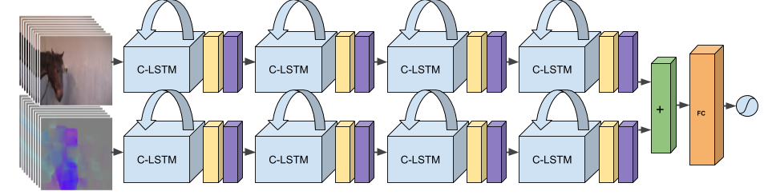

This repository contains the code for the following two papers on automatic pain recognition in horses.

[CVPR 2019](http://openaccess.thecvf.com/content_CVPR_2019/html/Broome_Dynamics_Are_Important_for_the_Recognition_of_Equine_Pain_in_CVPR_2019_paper.html):

`   @InProceedings{Broome_2019_CVPR,
    author = {Broome, Sofia and Gleerup, Karina Bech and Andersen, Pia Haubro and Kjellstrom, Hedvig},
    title = {Dynamics Are Important for the Recognition of Equine Pain in Video},
    booktitle = {The IEEE Conference on Computer Vision and Pattern Recognition (CVPR)},
    month = {June},
    year = {2019}}`

[PLoS ONE 2022](https://journals.plos.org/plosone/article/metrics?id=10.1371/journal.pone.0263854):

`@article{10.1371/journal.pone.0263854,
    doi = {10.1371/journal.pone.0263854},
    author = {Broomé, Sofia AND Ask, Katrina AND Rashid-Engström, Maheen AND Haubro Andersen, Pia AND Kjellström, Hedvig},
    journal = {{PLoS ONE}},
    publisher = {Public Library of Science},
    title = {{Sharing pain: Using pain domain transfer for video recognition of low grade orthopedic pain in horses}},
    year = {2022},
    month = {03},
    volume = {17},
    url = {https://doi.org/10.1371/journal.pone.0263854},
    pages = {1-21},
    number = {3}
}`


If you find the code useful for your research, please cite the paper that is most relevant for you.

The best performing model for the task was the two-stream convolutional LSTM shown below, which is a fully recurrent deep network maintaining the spatial structure of the frames throughout the recurrences.



*NOTE*:
This repository has undergone many updates since 2019 (especially the data pipeline,
adapting it to a new horse dataset), and I have transferred the code to tensorflow,
tf.data and tf.keras. This means that the current state of the repo is better, and more readable.
If you specifically want to look at the state of the code in 2019, please use the branch `CVPR19`. Note that all experiments from then are possible to conduct in this version as well.


## Training

An execution line for training may look like this:

``` python main.py --config-file configs/config_2stream_local_test.py --test-run 1 --subjects-overview metadata/horse_subjects.csv --train-subjects 'horse_1/horse_2/horse_3/horse_4' --val-subjects 'horse_5' --test-subjects 'horse_6' --job-identifier test ```

Detailed configs for a run are specified in the config file.


## Testing

To only perform inference with an already trained Tensorflow model, specify a checkpoint path in the config file and set `'inference_only' = True` in the config. 

## Dataset

The equine datasets have unfortunately as of yet not been possible to make public.

The "PF" dataset (used in both articles) is further described in the article

`Karina Bech Gleerup, Björn Forkman, Casper Lindegaard and Pia Haubro Andersen
"An Equine Pain Face"
Veterinary Anaesthesia and Analgesia, 2015, 42, 103–114`.

The "EOP(j)" dataset (used in the Sharing Pain-article) is further described in

`Ask, Katrina; Rhodin, Marie; Tamminen, Lena-Mari; Hernlund, Elin; Haubro Andersen, Pia. 2020.
"Identification of Body Behaviors and Facial Expressions Associated with Induced Orthopedic Pain in Four Equine Pain Scales" Animals 10, no. 11: 2155.`


However, the code can and has previously been used on the human pain video dataset UNBC-McMaster shoulder pain expression archive database, which is publicly available and described [here](https://ieeexplore.ieee.org/document/5771462). Keep in mind that the total duration of the UNBC dataset is only 33 minutes assuming 25fps, and that pre-training on another dataset might be necessary in order to learn pain patterns with longer temporal extent for this one. Also, the pain behaviors of humans are arguably easier to catch in single frames since humans are more expressive than animals (more facial muscles, for instance), meaning that a two-stream recurrent network such as the one presented in this paper might not be the most efficient way to train on UNBC. I personally did not achieve competitive results on that one using the C-LSTM-2, but it was a few years back. If I would run on it today I would make sure to augment the minor pain class, to reduce the class imbalance, for instance, which might help. For this, it can perhaps be useful to look at the video buffer builder & resampler `get_sequences_from_frame_df(self, df)` inside `data_handler.py` on the master branch (not on the CVPR19 branch). (This paragraph was updated in Dec 2020)

To train and test the model on your own data, no matter the species or affective state of interest, the below data format should be adopted.

### Data format

This repository reads videos via extracted frames. See scripts for this purpose under `data_scripts`. A data folder, such as for example `data/jpg_128_128_2fps/` (let's refer to this folder by X), should be organized as follows:

X contains one subfolder per subject in the dataset (and once you have run, also their belonging `.csv`-files), like so:

```
ls X
horse_1 horse_1.csv horse 2 horse_2.csv horse_3 horse_3.csv horse_4 horse_4.csv horse_5 horse_5.csv horse_6 horse_6.csv 
```


These per-subject folders in turn contain one folder per clip, as in for example:

```
ls horse_1
1_1a_1 1_1a_2 1_1a_3 1_1b   1_2a   1_2b   1_3a_1 1_3a_2 1_3b   1_4    1_5_1  1_5_2
```

The clip-folders in turn contain the extracted frames for each clip.
 
```
data
|--jpg_128_128_2fps
|  |--horse_1.csv
|  |--horse_1
|     |--1_1a_1
|        |--frame_000001.jpg
|        |...
|        |--frame_002638.jpg
|     |--[more clips]
|  |[more horses]
|  |--horse_6.csv
|  |--horse_6
|     |--6_1a
|     |   |--frame_000001.jpg
|     |   |...
|     |   |--frame_004500.jpg
|     |--6_2a
|     |   |--frame_000001.jpg
|     |   |...
|     |   |--frame_000353.jpg
```


One `.csv`-file contains paths and label information for every frame of every clip for that particular horse. We use these to read the data.
From the beginning, the global label information for every clip is gathered from the `metadata/videos_overview_missingremoved.csv` file.
A list of the ID:s of the subjects of the dataset should also be provided in the `metadata`-folder.

